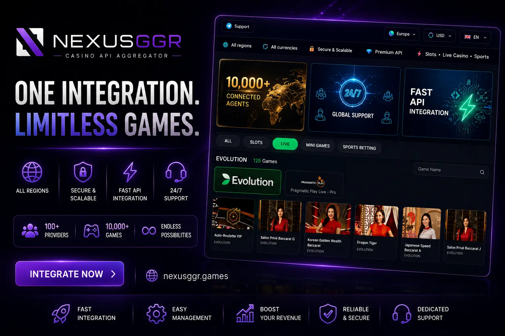

# NexusGGR FiversCan Casino API Aggregator — Slots, Live Casino & Sportsbook API

  

**NexusGGR** is a unified **casino API aggregator** for iGaming operators, agents, and platform owners. Integrate **slots API**, **live casino API**, **sportsbook API**, and **whitelabel betting** solutions through a single integration — powered by leading providers including **Pragmatic Play**, **PG Soft**, and more.

🌐 **[Live Demo](https://nexusggr.games?utm_source=github&utm_medium=readme&utm_campaign=casino-api)** &nbsp;|&nbsp; 📢 **[Telegram Channel](https://t.me/casino_api777)** &nbsp;|&nbsp; 💬 **[Contact Us](https://t.me/nexusggr888)**

---

## About NexusGGR Casino API

NexusGGR provides a full-stack **iGaming API** solution for launching and scaling online casino and sports betting platforms. Whether you need a **casino API**, **cassino API** (Brazil/LATAM markets), **bahis sports API**, or a complete **whitelabel betting** backend — NexusGGR delivers one API layer to connect hundreds of games and sports markets.

Built for **FiversCan**-compatible workflows and modern aggregator architectures, NexusGGR helps operators go live faster with less integration overhead.

## Key Features

- **Slots API** — Thousands of slot games from top studios (Pragmatic Play, PG Soft, and more)
- **Live Casino API** — Real-time dealer tables: baccarat, roulette, blackjack, game shows
- **Sportsbook API** — Pre-match and live sports betting (football, basketball, tennis, esports)
- **Whitelabel Betting** — Brand your platform; we handle the game and odds infrastructure
- **Single Integration** — One API endpoint for slots, live casino, and sports
- **Multi-Currency & Multi-Language** — Built for global and regional iGaming markets
- **Agent & Operator Panels** — Manage players, agents, reports, and settlements
- **Fast Deployment** — Launch your iGaming platform in days, not months

## Integration Code Samples (22 Languages)

Every `index.*` file in this repository is a complete, runnable **FiversCan API** client that walks the same seven calls an operator needs to go live: `provider_list` → `game_list` → `user_create` → `user_deposit` → `game_launch` → `money_info` → `user_withdraw`.

The API contract is identical in every language — `POST https://{API_SERVER}` with a JSON body carrying `method`, `agent_code` and `agent_token`, answered by `{"status": 1, "msg": "SUCCESS", ...}` on success or `{"status": 0, "msg": "<ERROR>"}` on failure. Set `FVS_API_URL`, `FVS_AGENT_CODE` and `FVS_AGENT_TOKEN` in the environment and run the file.

| Language | File | Stack |
|----------|------|-------|
| JavaScript (Node.js) | [index.js](index.js) | built-in `fetch` |
| TypeScript | [index.ts](index.ts) | `fetch`, typed responses |
| Python | [index.py](index.py) | `urllib` (stdlib) |
| PHP | [index.php](index.php) | `ext-curl` + `ext-json` |
| Go | [index.go](index.go) | `net/http` + `encoding/json` |
| Java | [Index.java](Index.java) | `java.net.http` + `org.json` |
| Kotlin | [index.kt](index.kt) | `java.net.http` + `kotlinx.serialization.json` |
| C# (.NET) | [index.cs](index.cs) | `HttpClient` + `System.Text.Json` |
| Ruby | [index.rb](index.rb) | `net/http` + `json` (stdlib) |
| Rust | [index.rs](index.rs) | `reqwest` + `serde_json` |
| Swift | [index.swift](index.swift) | `URLSession` + `JSONSerialization` |
| Dart | [index.dart](index.dart) | `dart:io` + `dart:convert` |
| C++ | [index.cpp](index.cpp) | `libcurl` + `nlohmann/json` |
| C | [index.c](index.c) | `libcurl` + `cJSON` |
| Perl | [index.pl](index.pl) | `HTTP::Tiny` + `JSON::PP` (core) |
| Lua | [index.lua](index.lua) | `luasocket` + `luasec` + `lua-cjson` |
| Bash | [index.sh](index.sh) | `curl` + `jq` |
| PowerShell | [index.ps1](index.ps1) | `Invoke-RestMethod` |
| Elixir | [index.exs](index.exs) | `Req` via `Mix.install` |
| Scala 3 | [index.scala](index.scala) | `requests-scala` + `uJson` (scala-cli) |
| Haskell | [index.hs](index.hs) | `http-conduit` + `aeson` |
| R | [index.R](index.R) | `httr2` + `jsonlite` |

## Supported Game Providers

| Category | Providers |
|----------|-----------|
| **Slots** | Pragmatic Play, PG Soft, and 50+ slot studios |
| **Live Casino** | Evolution-style live tables, baccarat, roulette, sic bo |
| **Sports** | Football, basketball, tennis, cricket, esports, virtual sports |
| **Arcade & Fishing** | Fishing games, crash games, mini games |

## Who Is This For?

- **iGaming operators** launching a new online casino or sportsbook
- **Agents & master agents** building a multi-tier betting network
- **Platform developers** needing a reliable **casino API aggregator**
- **LATAM & Asia markets** — cassino API, bahis, and regional payment support
- **Whitelabel partners** seeking turnkey betting infrastructure

## Why Choose NexusGGR?

| Benefit | Description |
|---------|-------------|
| **One API, All Products** | Slots, live casino, and sportsbook under one contract |
| **Proven Infrastructure** | Stable API uptime for high-traffic iGaming platforms |
| **Scalable Architecture** | From startup operators to enterprise-level volume |
| **Dedicated Support** | Direct Telegram support for integration and operations |
| **Competitive GGR** | Flexible commercial terms for agents and operators |

## Quick Links

| Resource | Link |
|----------|------|
| 🎰 **Live Demo & Platform** | [nexusggr.games](https://nexusggr.games?utm_source=github&utm_medium=readme&utm_campaign=casino-api) |
| 📢 **Telegram Channel** (updates & API news) | [@casino_api777](https://t.me/casino_api777) |
| 💬 **Contact / Business Inquiry** | [@nexusggr888](https://t.me/nexusggr888) |

## Frequently Asked Questions

### What is a casino API aggregator?

A **casino API aggregator** connects your platform to multiple game providers through a single integration. Instead of signing separate contracts with Pragmatic Play, PG Soft, and others, you integrate once with NexusGGR and access the full game catalog.

### Does NexusGGR support live casino and sports betting?

Yes. NexusGGR covers **slots API**, **live casino API**, and **sportsbook API** — including pre-match and in-play betting markets.

### Is NexusGGR a whitelabel betting solution?

Yes. NexusGGR offers **whitelabel betting** and casino infrastructure so you can launch under your own brand with custom domains, themes, and player management.

### Which markets does NexusGGR support?

NexusGGR serves global iGaming markets including Asia, Europe, and LATAM — with support for regional terms like **cassino API** (Brazil/Portugal) and **bahis** (Turkey/MENA sports betting).

### How do I get started?

Visit the [live demo](https://nexusggr.games?utm_source=github&utm_medium=readme&utm_campaign=casino-api), join our [Telegram channel](https://t.me/casino_api777) for updates, or [contact us on Telegram](https://t.me/nexusggr888) for API access and commercial terms.

---

  <strong>NexusGGR</strong> — Casino API · Slots API · Live Casino API · Sportsbook API · iGaming Whitelabel 
  Last updated: 2026-07-21 06:00 UTC

<!-- last-updated: 2026-07-21 06:00 UTC -->
